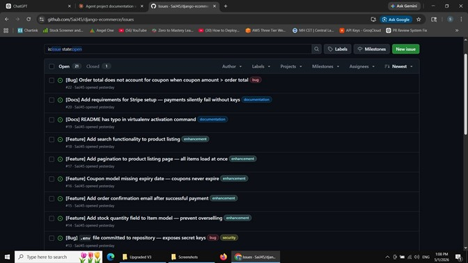
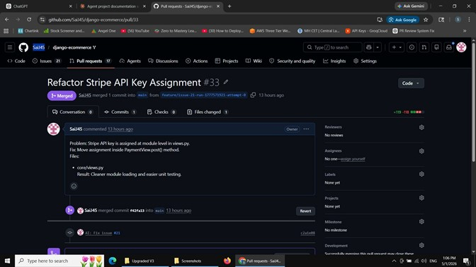
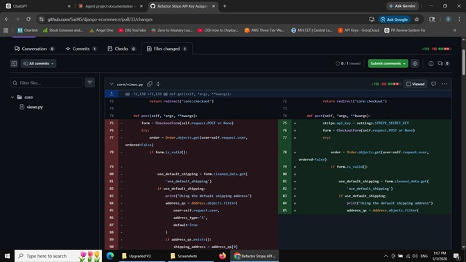
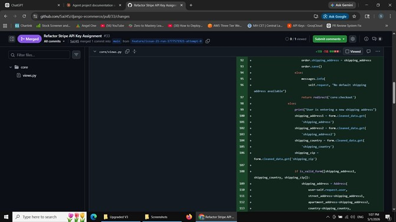
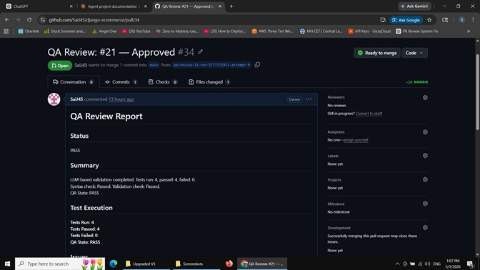

<div align="center">

# Autonomous GitHub Issue Resolution System

### An autonomous AI pipeline that resolves GitHub issues end-to-end
### No human needed after issue selection.

**`Issue` → `Plan` → `Patch` → `PR` → `QA` → `Merge`** — fully automated.

[](https://python.org)
[](https://github.com/langchain-ai/langgraph)
[](https://groq.com)
[](https://github.com/facebookresearch/faiss)
[](/)
[](LICENSE)

*Built by Sai Sachin Jawalkar · March – May 2026*

</div>

---

## What it does

Most AI coding tools hallucinate fixes and hand the mess back to you. This system doesn't stop at generating a patch — it validates the patch with AST analysis, generates test cases, simulates them, and only merges if everything passes. If tests fail, it **self-heals**: diagnoses the failure stage, clears a bad plan, and tries a smarter strategy.

```
You select an issue.
Everything else is automatic.
```

---

## Screenshots

<div align="center">

| GitHub Issues | Merged Pull Request |
|:---:|:---:|
|  |  |

| Code Diff (Part 1) | Code Diff (Part 2) |
|:---:|:---:|
|  |  |

| Closed PRs | QA Review Report |
|:---:|:---:|
|  |  |

</div>

---

## Demo

> Real runs on a live Django e-commerce repository — no cherry-picking.

### Run 1 — Issue resolved and merged on first attempt

https://youtu.be/kh9ZydnqNkI

### Run 2 — Self-healing retry loop: REJECTED → re-planned → APPROVED

https://youtu.be/FkWlz3Peqb0

### Run 3 — Full pipeline with live QA report

https://youtu.be/gLFJFGBk-ZY

---

## Proven results

5 real issues run against [`SaiJ45/django-ecommerce`](https://github.com/SaiJ45/django-ecommerce) — 21 open issues, bugs and features across payment processing, auth, and cart logic.

| # | GitHub Issue | Fix PR | QA PR | Result | Attempts | What happened |
|---|-------------|--------|-------|--------|----------|---------------|
| TC-1 | [#21] Stripe API key at module scope | [#33] ✅ | [#34] | **APPROVED** | 1 | Moved `stripe.api_key` into `PaymentView.post()` — clean surgical fix |
| TC-2 | [#3] `AttributeError` on `sources.create` | [#25] | [#28] | **REJECTED** | 1 | Planner targeted wrong function; QA caught it, retry triggered |
| TC-3 | [#18] Product listing has no search bar | [#77→#79] ✅ | [#78→#80] | **REJECTED → APPROVED** | 2 | Attempt-0 missing `query.strip() != ''` guard; attempt-1 fixed all 5 QA issues, 7/7 tests passed |
| TC-4 | [#16] Coupons never expire | [#58] ✅ | — | **APPROVED** | 1 | Added `valid_from`, `valid_to`, `active` fields + `is_valid()` method across 2 files |
| TC-5 | [#22] Negative order total when coupon > total | [#56] ✅ | — | **APPROVED** | 1 | Single-line `return max(total, 0)` — minimal strategy, perfect execution |

**4/5 merged automatically. TC-3 shows the retry loop working end-to-end: failure stage correctly identified as `coder` (not `planner`), routed to `feedback_guided` mode, second attempt resolved all 5 QA failures.**

---

## How it works

### The pipeline

```
                    ┌─────────────────────────────────────────────────────┐
                    │              LANGGRAPH STATE MACHINE                │
                    └─────────────────────────────────────────────────────┘

 fetch_issues ──► select_issue ──► setup_repo ──► issue_agent ──► verify_plan
                     (you)                           │                 │
                                              ┌──────┘           AST confidence
                                              │                  check (Tree-sitter)
                                         ┌────▼────┐
                                         │ ISSUE   │  • Reads issue + comments
                                         │  AGENT  │  • FAISS semantic file search
                                         │         │  • AST code chunk retrieval
                                         │         │  • LLM structured plan
                                         │         │  • Patch gen + 10-rule validation
                                         └────┬────┘
                                              │
                              integration ──► issue_pr ──► diff
                                              │
                              test_generation ──► test_simulation ──► llm_validation
                                              │
                              qa_pr ──► decision ──► validate_qa ──► merge ✅
                                           │
                                     REJECTED?
                                           │
                              retry_handler ──► qa_normalization ──► issue_agent 🔁
                              (diagnose stage, escalate strategy, clear plan if needed)
```

### Two specialised agents

**Issue Agent** — understands the issue and writes the fix
- Reads issue body, labels, and linked comments from GitHub
- Two-stage retrieval: embedding-based file ranking (FAISS + BAAI/bge-small-en-v1.5), then AST-level function/class chunking — the LLM sees targeted context, not entire files
- Structured JSON planner: every target must have `file`, `symbol`, `class_name`, `symbol_type`
- Patch generation with class-aware AST targeting (matches class first, then method inside — wrong-class matches get −50 score penalty)
- Pre-acceptance validation: `ast.parse()` + structural integrity + indentation + import integrity + behavioral change + per-function scope (max 80 lines changed)

**QA Agent** — strict gatekeeper, no rubber-stamping
- Analyzes the unified diff for risk level, critical issues, and logic errors
- Generates up to 12 structured test cases from patch context via LLM
- Simulates each test case with pass/fail/uncertain verdict — shallow reasoning (`seems`, `likely`, `probably`) is flagged as low-confidence
- Hard gating rules: `exit_code == 0` AND no critical issues AND risk ≤ MEDIUM → **APPROVED**

### 10 enforced rules (V11)

Every patch runs a gauntlet of 10 rules before it can reach QA. Rules 6 and 9 are the two critical additions in V11:

| Rule | Enforced in | What it prevents |
|------|------------|-----------------|
| 1 — Structured planner output | `planner.py` | Plans with missing `class_name` or `symbol_type` are rejected before any code is written |
| 2 — Class-then-method AST traversal | `patch_generator.py` | Wrong-class method matches penalised −50pts; must match class container first |
| 3 — Exact block preservation | `patch_generator.py` | Section patch replaces precise line ranges only; surrounding code is never touched |
| 4 — Real source context for diffs | `patch_generator.py` | Primary: full file output. Fallback: 3-level fuzzy hunk matching against actual file content |
| 5 — AST validation before acceptance | `llm_validation_node` | `ast.parse()`, structural integrity, indentation, imports, behavioral change, scope — all must pass |
| **6 ⭐ — Clear plan on coder failure** | `retry_handler_node` | When coder fails → `plan = None`, `planner_mode = "full"` — forces complete re-analysis, not reuse of a broken plan |
| 7 — Different strategy on retry | `retry_handler_node` | Escalates: `normal → function-only → minimal`. Behavioral failures trigger `force_append` path |
| 8 — Detect repeated failures | `decision_node` | Two consecutive identical `{failure_type}:{reason}` signatures → `FAILED_TERMINATED`. No infinite loops. |
| **9 ⭐ — Reject trivial patches** | `llm_validation_node` | `NO_REAL_MODIFICATION` if files are identical; `MINIMAL_FIX_INSUFFICIENT` if no behavioral change on retry |
| 10 — Allow distinct attempts | `decision_node` | Never terminates on the retry count alone — only terminates early if same failure repeats (Rule 8) |

---

## Project structure

```
multi-agent-system/
│
├── main.py                              # Entry point — validates API keys, builds graph, runs
├── sync_envs.py                         # Propagates .env.master to all sub-agent .env files
├── requirements.txt
├── .env.master                          # ← single source of truth for all credentials
│
├── langgraph_flow/
│   ├── graph.py                         # StateGraph: node registration + conditional edges
│   ├── nodes.py                         # All ~20 node implementations (3000+ lines)
│   └── state.py                         # AgentState Pydantic model (shared pipeline state)
│
├── agents/
│   ├── ai_issue_agent/
│   │   ├── graph.py                     # Issue Agent's own sub-graph
│   │   └── agents/
│   │       ├── issue_reader.py          # GitHub issue + comment fetcher
│   │       ├── file_selector.py         # FAISS semantic file ranking
│   │       ├── code_retriever.py        # AST function/class chunk extractor
│   │       ├── planner.py               # Structured JSON planner (Rule 1 enforced)
│   │       ├── patch_generator.py       # Patch gen + class-aware AST + diff fallback
│   │       ├── issue_grounding.py       # Symbol/file/keyword extractor from issue text
│   │       └── output_validators.py     # All structural + behavioral validation checks
│   │
│   └── ai_qa_agent/
│       └── nodes/
│           ├── analyze_diff.py          # Diff risk scoring + issue detection
│           ├── run_tests.py             # Test simulation with LLM
│           └── decision.py              # Hard APPROVED / REJECTED gating
│
├── adapters/
│   └── issue_agent_adapter.py           # Decouples Issue Agent API from LangGraph state
│
├── integration/
│   ├── diff_generator.py
│   ├── patch_applier.py
│   ├── git_handler.py
│   └── memory_store.py                  # Persistent fix-pattern memory (JSON + embeddings)
│
└── utils/
    ├── llm_utils.py
    ├── logger.py
    └── validators.py
```

---

## Quick start

### Prerequisites

- Python 3.9+
- Git
- [Groq API key](https://console.groq.com) — free tier works fine
- GitHub Personal Access Token with `repo` scope ([generate here](https://github.com/settings/tokens))
- A GitHub repository you own or have forked (the system needs write access to open PRs)

### Setup

```bash
# 1. Clone
git clone https://github.com/YOUR_USERNAME/multi-agent-system.git
cd multi-agent-system

# 2. Virtual environment
python -m venv venv
source venv/bin/activate        # Windows: venv\Scripts\activate

# 3. Install dependencies
pip install -r requirements.txt

# 4. Configure credentials
cp .env.example .env.master
```

Edit `.env.master`:

```env
GROQ_API_KEY=gsk_...

GITHUB_TOKEN=ghp_...
GITHUB_REPO=YourUsername/your-repo
REPO_OWNER=YourUsername
REPO_NAME=your-repo
```

```bash
# 5. Propagate credentials to all sub-agents
python sync_envs.py

# 6. Run
python main.py
```

The system validates your API keys, fetches open issues, prompts you to select one, then runs autonomously from there.

---

## Configuration

### Using a different repository

The system works against any GitHub repo. You need write access (fork if necessary).

1. Fork or ensure you own the target repository
2. Generate a GitHub PAT: Settings → Developer Settings → Personal Access Tokens → Tokens (classic) → `repo` scope
3. Update `GITHUB_TOKEN`, `GITHUB_REPO`, `REPO_OWNER`, `REPO_NAME` in `.env.master`
4. Run `python sync_envs.py`

### Switching the LLM

The system uses Groq (Llama-3.3-70B) for fast, free prototyping. Swapping to a stronger model is four find-and-replace operations — LangChain handles the abstraction:

| File | Change |
|------|--------|
| `agents/ai_issue_agent/agents/planner.py` | `ChatGroq(...)` → `ChatAnthropic(...)` or `ChatOpenAI(...)` |
| `agents/ai_issue_agent/agents/patch_generator.py` | Same |
| `agents/ai_qa_agent/llm_config.py` | Update `get_llm()` |
| `langgraph_flow/nodes.py` | Update `test_generation_agent_node` and `test_simulation_agent_node` |

Update the API key in `.env.master` accordingly (e.g. `ANTHROPIC_API_KEY=...`).

> **Strongly recommended:** GPT-4o, Claude Opus, or Gemini 1.5 Pro will meaningfully improve patch quality and planning accuracy — especially on complex multi-file issues. TC-2 and TC-3 both required retries that a more capable model would likely resolve in one shot.

---

## Failure handling

| State | Cause | Recovery |
|-------|-------|----------|
| `FAILED_FETCH` | GitHub API unreachable or zero open issues | Check `GITHUB_TOKEN` and repo access |
| `FAILED_SETUP` | Repository clone or branch creation failed | Verify `GITHUB_REPO` format and token scope |
| `FAILED_PATCH` | Issue Agent could not produce a valid patch after all retries | Check Groq API key; consider stronger LLM |
| `FAILED_TESTS` | QA Agent rejected every attempt | Review `fail_summary_*.json` for failure type breakdown |
| `FAILED_MERGE` | PR merge operation failed post-approval | Check branch protection rules on the target repo |
| `FAILED_TERMINATED` | Same failure type appeared twice consecutively (Rule 8) | Issue may require manual intervention; see failure logs |

After each run a `fail_summary_<issue_number>.json` file is written to the project root with: `plan`, `failure_stage`, `failure_type`, `all_feedback_history`, `retry_count`, `attempts`, and `failures` — everything you need to understand what happened.

---

## Dependencies

| Package | Purpose |
|---------|---------|
| `langgraph` | State machine orchestration with MemorySaver checkpointing |
| `langchain` + `langchain-groq` | LLM chain abstractions and Groq provider integration |
| `groq` | Direct Groq API client |
| `sentence-transformers` | BAAI/bge-small-en-v1.5 for issue and code embeddings |
| `faiss-cpu` | Vector similarity search for semantic file selection |
| `PyGithub` | GitHub REST API — issues, PRs, merges, comments |
| `pydantic` | Immutable `AgentState` model with validation |
| `tenacity` | Retry logic with exponential backoff on API calls |
| `python-dotenv` | Environment variable loading from `.env` files |
| `pytest` | Test infrastructure for pipeline validation tests |

---

## Roadmap

The system is built to be extended. Every item below has a concrete implementation path grounded in the existing codebase.

| # | Upgrade | Why it matters |
|---|---------|---------------|
| 1 | **Real pytest execution in Docker** | LLM test simulation passes TC-2-style patches that fail at runtime. Replace `test_simulation_agent_node` with an actual `pytest` harness in a sandboxed container. |
| 2 | **Stronger LLM provider** | Groq/Llama is fast and free but struggles on complex multi-file issues. LangChain abstraction makes the swap 4 lines of code. |
| 3 | **Multi-language support** | AST stack is Python-only. Tree-sitter already supports JS/TS/Java/Go — needs a `language_profile` field in `AgentState` and runner branching in QA. |
| 4 | **Expanded memory store** | 50-record JSON cap underutilises the growing corpus of approved fixes. Replace with ChromaDB; inject top-3 similar past solutions as few-shot examples into the planner. |
| 5 | **Autonomous issue selection** | `select_issue` is the only manual step. `issue_grounding.py` already scores issue clarity — add an `issue_ranker` node and an `AUTO_SELECT_THRESHOLD` env flag. |
| 6 | **Monitoring dashboard** | `node_traces` and `failures` are rich but only visible as raw JSON. FastAPI backend + React UI with live Gantt-style pipeline view and human override capability. |
| 7 | **Parallel issue processing** | Sequential runs cap throughput. LangGraph `MemorySaver` is thread-safe; branch naming already prevents PR conflicts. Add `asyncio` batch mode with rate-limit guard. |
| 8 | **PR review comment integration** | The system already posts QA reports to PRs. Read `[MAS-FEEDBACK]:` tags from human reviewers back into `qa_feedback_history` to close the loop. |
| 9 | **Patch quality scoring** | All passing patches are treated equally. A 5-component score (scope precision, line economy, semantic alignment, AST gate coverage, retry penalty) would let the memory store rank reliable fixes and let the retry handler calibrate escalation. |
| 10 | **Planner reasoning traces** | When Rule 6 clears a failed plan, there's no record of why the original target was chosen. Extend the plan schema with `reasoning` blocks — candidate files considered, alternatives rejected, confidence level. Inject failed reasoning as a negative example on the next attempt. |

---

## License

MIT — see [LICENSE](LICENSE) for details.

---

<div align="center">

Built with [LangGraph](https://github.com/langchain-ai/langgraph) · [LangChain](https://github.com/langchain-ai/langchain) · [Groq](https://groq.com) · [GitHub API v3](https://docs.github.com/en/rest) · [FAISS](https://github.com/facebookresearch/faiss)

</div>
